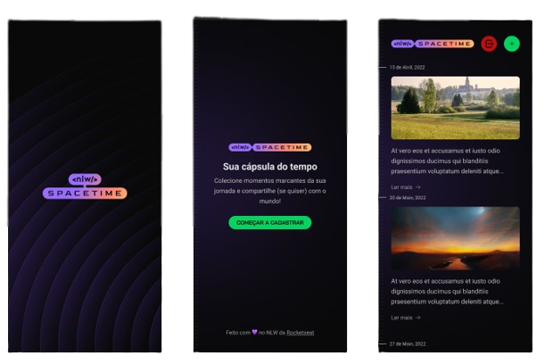
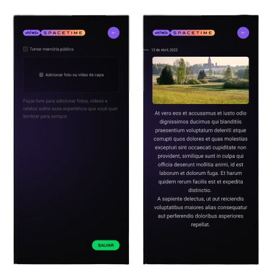

<h1 align="center"> Cápsula do tempo com NodeJs (Back-end), ReactJs (Front-end) e React-Native (Mobile) </h1>

## 📖 Sobre o projeto
A Cápsula do Tempo é um projeto multiplataforma, onde você pode carregar suas fotos e adicionar uma descrição a cada uma delas. E o melhor é que você pode fazer login usando sua conta do GitHub, facilitando o acesso e garantindo a segurança dos seus dados.

A plataforma organiza suas memórias de forma cronológica, permitindo que você reviva momentos especiais do passado. As memórias são armazenadas em um banco de dados SQL e gerenciadas pelo ORM Prisma, garantindo a confiabilidade da preservação das suas memórias.

### 💻 Backend:
* TypeScript
* NodeJS
* Fastify
* Prisma
* JWT
* SQLite
* ESlint

### 🌐 Web:
* TypeScript
* ReactJS
* NextJS
* TailwindCSS
* Axios
* ESlint

## Mobile

* TypeScript
* React Native
* Expo
* Axios
* NativeWind
* ESlint

## 📌 Funcionalidades
* Login usando GitHub
* Upload de fotos ou vídeos de até 5 MB
* Adição de descrição às memórias
* Organização das memórias por data
* Visualização das memórias
* Logout

## 🛠️ Tecnologias

&nbsp;
&nbsp;
&nbsp;
&nbsp;
&nbsp;
&nbsp;
&nbsp;
&nbsp;
&nbsp;
&nbsp;
&nbsp;
&nbsp;
&nbsp;

